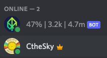

## eden-stats-bot
A discord bot to show eden network stats.

## install & run
```bash
# install dependencies
npm install

# setup environment variables
export TOKEN=<discord bot token>
export GUILD_ID=<server guild id>

# run bot
node bot.js
```

## bot permission
it needs bot and change nickname permission.

## demo


## implementation
- fetch explorer page and parse stats from html
- set nick name to show stats
